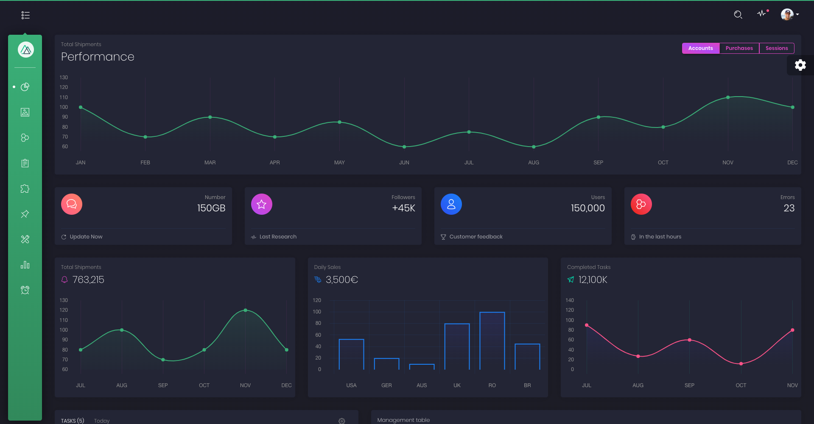
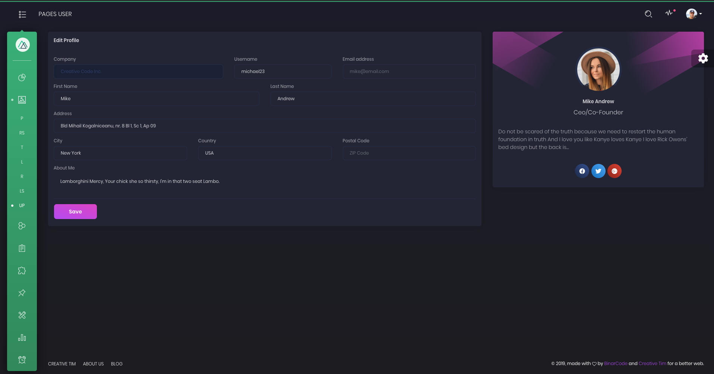
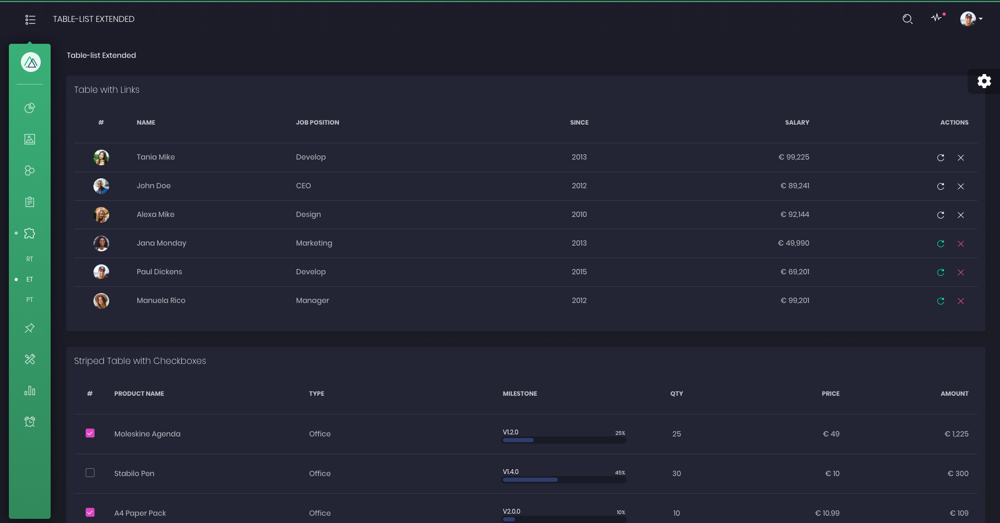
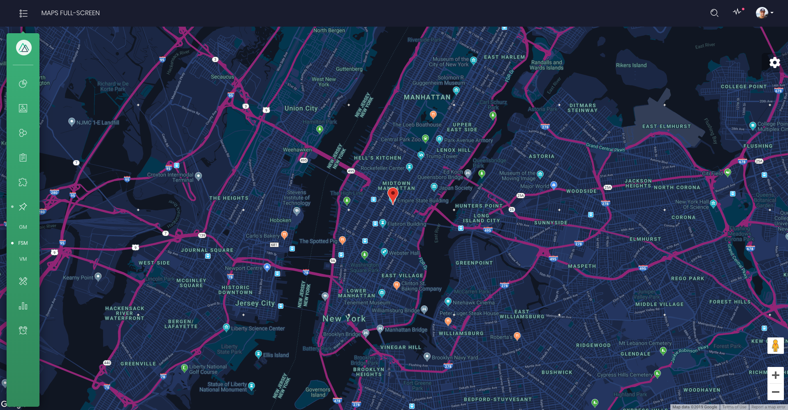
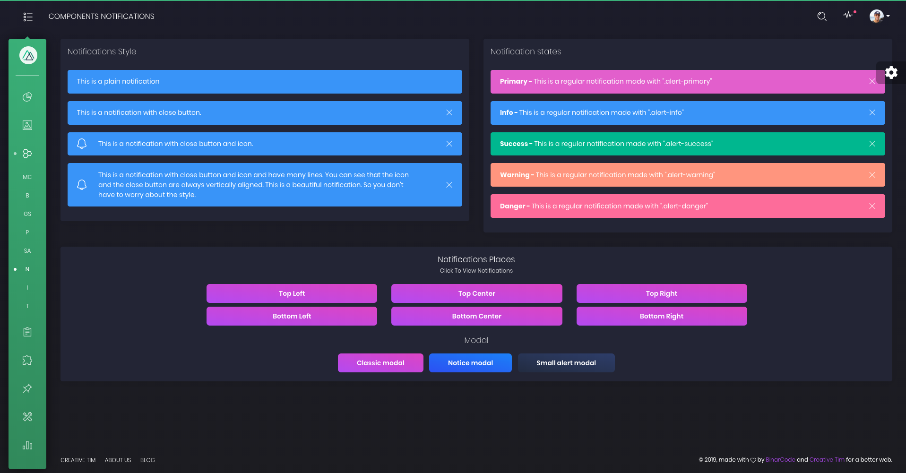

# [Nuxt Black Dashboard PRO](https://demos.creative-tim.com/nuxt-black-dashboard-pro) [](https://twitter.com/intent/tweet?url=https%3A%2F%2Fdemos.creative-tim.com%2Fnuxt-black-dashboard-pro&text=Nuxt%20Black%20Dashboard%20PRO%20-%20Premium%20Nuxt%20Admin%20Template&original_referer=https%3A%2F%2Fdemos.creative-tim.com%2Fnuxt-black-dashboard-pro%2F&via=creativetim&hashtags=vuejs%2Cbootstrap%2Cnuxt%2Ccreativetim%2Ccreativetimofficial)


 []() []()  [](https://discord.gg/E4aHAQy)


[Nuxt Black Dashboard PRO](https://demos.creative-tim.com/nuxt-black-dashboard-pro) is a beautiful Bootstrap 4 Admin Dashboard that comes in 2 versions: Dark and Light Mode. If you are looking for a tool to manage and visualize data about your business, this dashboard is the thing for you. It combines colors that are easy on the eye, spacious cards, beautiful typography, and graphics.

We made it our priority to not add things that you don't need, so the Nuxt Black Dashboard PRO comes with just enough features for you to easily use. It combines multiple components and plugins and features numerous example of how it can be used. Inside the archive, you will also find multiple example pages to get you started or provide inspiration.

[Nuxt Black Dashboard PRO](https://demos.creative-tim.com/nuxt-black-dashboard-pro) is the extended version of [Black Dashboard PRO](https://themes.getbootstrap.com/product/black-dashboard-pro-premium-bootstrap-4-admin/). Based on feedback from people that downloaded and used it, we have added needed components, and we have created multiple examples pages. We are curious to see how you want to use it and also improve it, so let us know any feedback you have.


Special thanks go for the owners of these plugins:
- [chartjs](https://www.chartjs.org/)
- [nouislider](https://refreshless.com/nouislider/)
- [nucleoapp](https://nucleoapp.com/?ref=1712)
- [perfect-scrollbar](https://www.npmjs.com/package/perfect-scrollbar)
- [element-ui](https://element.eleme.io)
- [nuxt.js](https://nuxtjs.org)

We are very excited to share this dashboard with you and we look forward to hearing your feedback!

**Example Pages** We wanted to fully display the power of this dashboard, so the kit comes packed with examples showing you how to use the components.

## Table of Contents

* [Versions](#versions)
* [Demo](#demo)
* [Quick Start](#quick-start)
* [Documentation](#documentation)
* [File Structure](#file-structure)
* [Browser Support](#browser-support)
* [Resources](#resources)
* [Reporting Issues](#reporting-issues)
* [Technical Support or Questions](#technical-support-or-questions)
* [Licensing](#licensing)
* [Useful Links](#useful-links)


## Versions

[](https://themes.getbootstrap.com/product/black-dashboard-pro-premium-bootstrap-4-admin/)
[](https://www.creative-tim.com/product/black-dashboard-pro-react)[](https://www.creative-tim.com/product/vue-black-dashboard-pro)


| HTML | React | Vue | Nuxt |
| --- | --- | --- | --- |
| [](https://themes.getbootstrap.com/product/black-dashboard-pro-premium-bootstrap-4-admin/) | [](https://www.creative-tim.com/product/black-dashboard-pro-react) | [](https://www.creative-tim.com/product/vue-black-dashboard-pro) | [](https://www.creative-tim.com/product/nuxt-black-dashboard=pro) |

## Demo

| Dashboard | User Profile | Tables | Maps | Notification |
| --- | --- | --- | --- | --- |
| [](https://demos.creative-tim.com/nuxt-black-dashboard-pro) | [](https://demos.creative-tim.com/nuxt-black-dashboard-pro/pages/user) | [](https://demos.creative-tim.com/nuxt-black-dashboard-pro/table-list/extended) | [](https://demos.creative-tim.com/nuxt-black-dashboard-pro/maps/full-screen) | [](https://demos.creative-tim.com/nuxt-black-dashboard-pro/components/notifications)

[View More](https://demos.creative-tim.com/nuxt-black-dashboard-pro/#/admin/dashboard).


## Quick start

Quick start options:

- [Buy from Creative Tim](https://www.creative-tim.com/product/nuxt-black-dashboard-pro).


## Documentation
The documentation for the Nuxt Black Dashboard PRO is hosted at our [website](https://demos.creative-tim.com/nuxt-black-dashboard-pro/documentation).


## File Structure

Within the download you'll find the following directories and files:

```
|-- Nuxt Black Dashboard PRO
    |-- CHANGELOG.md
    |-- README.md
    |-- app.html
    |-- config.js
    |-- jsconfig.json
    |-- nuxt.config.js
    |-- package.json
    |-- assets
    |   |-- README.md
    |   |-- css
    |   |   |-- demo.css
    |   |   |-- nucleo-icons.css
    |   |-- fonts
    |   |   |-- nucleo.eot
    |   |   |-- nucleo.ttf
    |   |   |-- nucleo.woff
    |   |   |-- nucleo.woff2
    |   |-- sass
    |       |-- black-dashboard-pro.scss
    |       |-- vendor
    |           |-- bootstrap-rtl.scss
    |-- components
    |   |-- AnimatedNumber.vue
    |   |-- Badge.vue
    |   |-- BaseAlert.vue
    |   |-- BaseButton.vue
    |   |-- BaseDropdown.vue
    |   |-- BasePagination.vue
    |   |-- BaseProgress.vue
    |   |-- BaseSwitch.vue
    |   |-- BaseTable.vue
    |   |-- CloseButton.vue
    |   |-- ImageUpload.vue
    |   |-- LoadingPanel.vue
    |   |-- Modal.vue
    |   |-- NavbarToggleButton.vue
    |   |-- README.md
    |   |-- Slider.vue
    |   |-- directoryList.md
    |   |-- index.js
    |   |-- Breadcrumb
    |   |   |-- Breadcrumb.vue
    |   |   |-- BreadcrumbItem.vue
    |   |   |-- RouteBreadcrumb.vue
    |   |-- Calendar
    |   |   |-- Calendar.vue
    |   |   |-- CalendarHeader.vue
    |   |-- Cards
    |   |   |-- Card.vue
    |   |   |-- StatsCard.vue
    |   |-- Charts
    |   |   |-- BarChart.js
    |   |   |-- LineChart.js
    |   |   |-- PieChart.js
    |   |   |-- config.js
    |   |   |-- utils.js
    |   |-- Collapse
    |   |   |-- Collapse.vue
    |   |   |-- CollapseItem.vue
    |   |-- Dashboard
    |   |   |-- CountryMapCard.vue
    |   |   |-- TaskList.vue
    |   |   |-- UserTable.vue
    |   |-- ExtendedTables
    |   |   |-- ShoppingTable.vue
    |   |-- Headers
    |   |   |-- SweetAlertHeader.vue
    |   |-- Inputs
    |   |   |-- BaseCheckbox.vue
    |   |   |-- BaseInput.vue
    |   |   |-- BaseRadio.vue
    |   |   |-- IconCheckbox.vue
    |   |   |-- TagsInput.vue
    |   |-- Layout
    |   |   |-- Content.vue
    |   |   |-- ContentFooter.vue
    |   |   |-- DashboardLayout.vue
    |   |   |-- DashboardNavbar.vue
    |   |   |-- LoadingMainPanel.vue
    |   |   |-- SidebarFixedToggleButton.vue
    |   |   |-- SidebarSharePlugin.vue
    |   |   |-- SidebarToggleButton.vue
    |   |-- Navbar
    |   |   |-- BaseNav.vue
    |   |   |-- NavbarToggleButton.vue
    |   |-- NotificationPlugin
    |   |   |-- Notification.vue
    |   |   |-- Notifications.vue
    |   |   |-- index.js
    |   |-- SidebarPlugin
    |   |   |-- SideBar.vue
    |   |   |-- SidebarItem.vue
    |   |   |-- index.js
    |   |-- Tabs
    |   |   |-- Tab.vue
    |   |   |-- Tabs.vue
    |   |-- Timeline
    |   |   |-- TimeLine.vue
    |   |   |-- TimeLineItem.vue
    |   |-- UserProfile
    |   |   |-- EditProfileForm.vue
    |   |   |-- UserCard.vue
    |   |-- ValidationForms
    |   |   |-- LoginForm.vue
    |   |   |-- RangeValidationForm.vue
    |   |   |-- RegisterForm.vue
    |   |   |-- TypeValidationForm.vue
    |   |-- Wizard
    |   |   |-- FirstStep.vue
    |   |   |-- SecondStep.vue
    |   |   |-- ThirdStep.vue
    |   |   |-- Wizard.vue
    |   |   |-- WizardTab.vue
    |   |   |-- throttle.js
    |   |-- WorldMap
    |       |-- WorldMap.vue
    |-- lang
    |   |-- ar.js
    |   |-- en.js
    |-- layouts
    |   |-- README.md
    |   |-- auth.vue
    |   |-- default.vue
    |-- middleware
    |   |-- README.md
    |-- pages
    |   |-- .DS_Store
    |   |-- README.md
    |   |-- calendar.vue
    |   |-- charts.vue
    |   |-- index.vue
    |   |-- lock.vue
    |   |-- login.vue
    |   |-- pricing.vue
    |   |-- register.vue
    |   |-- widgets.vue
    |   |-- GeneralViews
    |   |   |-- NotFoundPage.vue
    |   |-- components
    |   |   |-- buttons.vue
    |   |   |-- grid-system.vue
    |   |   |-- icons.vue
    |   |   |-- notifications.vue
    |   |   |-- panels.vue
    |   |   |-- sweet-alert.vue
    |   |   |-- typography.vue
    |   |-- forms
    |   |   |-- extended.vue
    |   |   |-- regular.vue
    |   |   |-- validation.vue
    |   |   |-- wizard.vue
    |   |-- maps
    |   |   |-- API_KEY.js
    |   |   |-- full-screen.vue
    |   |   |-- google.vue
    |   |   |-- vector-map.vue
    |   |-- pages
    |   |   |-- .DS_Store
    |   |   |-- rtl.vue
    |   |   |-- timeline.vue
    |   |   |-- user.vue
    |   |-- table-list
    |       |-- extended.vue
    |       |-- paginated.vue
    |       |-- regular.vue
    |       |-- users.js
    |-- plugins
    |   |-- README.md
    |   |-- RTLPlugin.js
    |   |-- dashboard-plugin.js
    |   |-- full-calendar.js
    |   |-- globalComponents.js
    |   |-- globalDirectives.js
    |   |-- world-map.js
    |   |-- directives
    |   |   |-- click-ouside.js
    |   |-- extra
    |       |-- polyfills.js
    |-- static
    |   |-- README.md
    |   |-- favicon.png
    |   |-- icon.png
    |   |-- sw.js
    |   |-- img
    |-- store
    |   |-- README.md
    |-- util
        |-- throttle.js
```

## Browser Support

At present, we officially aim to support the last two versions of the following browsers:

    


## Resources
- Demo: https://demos.creative-tim.com/nuxt-black-dashboard-pro
- Download Page: https://www.creative-tim.com/product/nuxt-black-dashboard-pro
- Documentation: https://demos.creative-tim.com/nuxt-black-dashboard-pro/documentation
- License Agreement: https://www.creative-tim.com/license
- Support: https://www.creative-tim.com/contact-us
- Issues: [Github Issues Page](https://github.com/creativetimofficial/ct-nuxt-black-dashboard-pro/issues)

## Reporting Issues
We use GitHub Issues as the official bug tracker for the Nuxt Black Dashboard PRO. Here are some advices for our users that want to report an issue:

1. Make sure that you are using the latest version of the Nuxt Black Dashboard PRO. Check the CHANGELOG from your dashboard on our [website](https://www.creative-tim.com/).
2. Providing us reproducible steps for the issue will shorten the time it takes for it to be fixed.
3. Some issues may be browser specific, so specifying in what browser you encountered the issue might help.

## Technical Support or Questions

If you have questions or need help integrating the product please [contact us](https://www.creative-tim.com/contact-us) instead of opening an issue.

## Licensing

- Copyright 2018 Creative Tim (https://www.creative-tim.com)
- Creative Tim [License](https://www.creative-tim.com/license)

## Useful Links

More products from Creative Tim: <https://www.creative-tim.com/products>

Tutorials: <https://www.youtube.com/channel/UCVyTG4sCw-rOvB9oHkzZD1w>

Freebies: <https://www.creative-tim.com/products>

Affiliate Program (earn money): <https://www.creative-tim.com/affiliates/new>

Social Media:

Twitter: <https://twitter.com/CreativeTim>

Facebook: <https://www.facebook.com/CreativeTim>

Dribbble: <https://dribbble.com/creativetim>

Google+: <https://plus.google.com/+CreativetimPage>

Instagram: <https://instagram.com/creativetimofficial>
